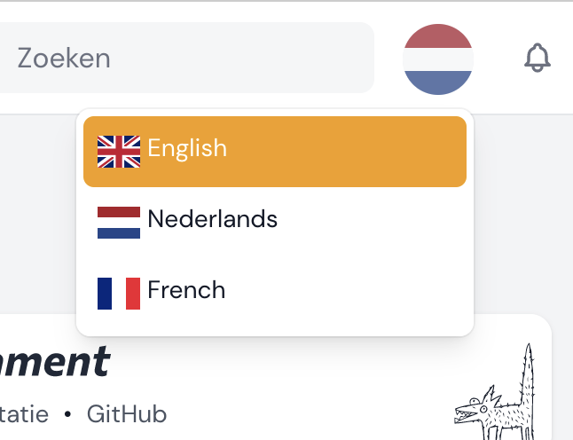

# Translation Manager

<a href="https://github.com/kenepa/translation-manager">

</a>

[](https://packagist.org/packages/kenepa/translation-manager)
[](https://packagist.org/packages/kenepa/translation-manager)

Introducing our Filament translation management tool, which allows you to easily manage, preview, and sync translations with your language files all within your Filament admin dashboard. Say goodbye to relying on developers to edit language files and streamline your localization workflow today.

<a href="https://github.com/kenepa/translation-manager">

</a>

## Installation

You can install the package via composer:

Install via Composer. This will download the package and [Laravel Excel](https://laravel-excel.com/).

| Plugin Version | Filament Version | PHP Version |
|----------------|-----------------|-------------|
| <= 3.x         | 2.x   | \> 8.0      |
| 4.x            | 3.x             | \> 8.1      |

```bash
composer require kenepa/translation-manager
```

You can run the following command to publish the configuration file:
```bash
php artisan vendor:publish --tag=translation-manager-config
```

This package uses `spatie/laravel-translation-loader`, publish their migration file using:
```bash
php artisan vendor:publish --provider="Spatie\TranslationLoader\TranslationServiceProvider" --tag="migrations"
```

You have to update the migration file to the following:
```php
Schema::create('language_lines', function (Blueprint $table) {
    $table->bigIncrements('id');
    $table->string('group')->index();
    $table->string('key')->index();
    $table->json('text')->default('[]');
    $table->timestamps();
});
```

Finally, run the migration.

## Register the plugin with a panel

```php
use Kenepa\ResourceLock\ResourceLockPlugin;
use Filament\Panel;
 
class AdminPanelProvider extends PanelProvider
{
    public function panel(Panel $panel): Panel
    {
        return $panel
            // ...
            ->plugin(TranslationManagerPlugin::make());
    }
}
```


## Authorization

By default, the translation manager cannot be used by anyone. You need to define the following gate in your `AppServiceProvider` boot method:

```php
Gate::define('use-translation-manager', function (?User $user) {
    // Your authorization logic
    return $user !== null && $user->hasRole('admin');
});
```

## Configuration
#### `available_locales`
Determines which locales your application supports. For example:
```php
'available_locales' => [
    ['code' => 'en', 'name' => 'English', 'flag' => 'gb'],
    ['code' => 'nl', 'name' => 'Nederlands', 'flag' => 'nl'],
    ['code' => 'de', 'name' => 'Deutsch', 'flag' => 'de']
]
```

#### `language_switcher`
Enable or disable the language switcher feature. This allows users to switch their language - disable if you have your own implementation.  


## Usage

Once installed, the Translation Manager can be accessed via the Filament sidebar menu. Simply click on the "Translation Manager" link to access the translation management screen.

## License

The MIT License (MIT). Please see [License File](LICENSE.md) for more information.