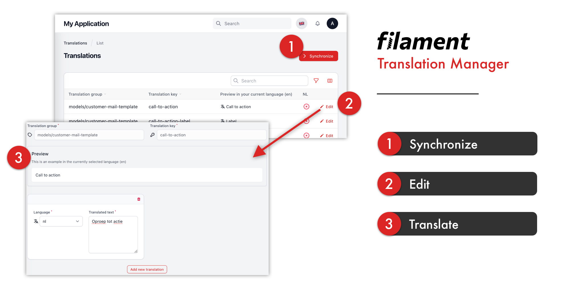

## Features

- Manage translations in your Filament admin dashboard 
- Preview translations in the current language 
- Synchronize translations with your language files 
- (Optional) language switcher feature

## Benefits

- No longer need to rely on developers that have to edit language files
- Conveniently manage translations without leaving your Filament admin dashboard
- Preview translations in real-time, allowing you to fine-tune them to your liking
- Simplify your localization workflow by syncing your translations with your language files 

## Installation

To install Filament Translation Manager, first require the package using Composer:

```bash
composer require musa11971/filament-translation-manager
```

You can run the following command to publish the configuration file:
```bash
php artisan vendor:publish --tag=filament-translation-manager-config
```

This package uses `spatie/laravel-translation-loader`, publish their migration file using:
```bash
php artisan vendor:publish --provider="Spatie\TranslationLoader\TranslationServiceProvider" --tag="migrations"
```

You have to update the migration file to the following:
```php
Schema::create('language_lines', function (Blueprint $table) {
    $table->bigIncrements('id');
    $table->string('group')->index();
    $table->string('key')->index();
    $table->json('text')->default('[]');
    $table->timestamps();
});
```

Finally, run the migration.

## (Optional) Enable the middleware
If you want to make use of the language switcher, you have to enable the middleware.  
First in `app/Http/Kernel.php` under the 'web' middleware group:  
```php
protected $middlewareGroups = [
    'web' => [
        // ... 
        // Add the middleware to the array
        \musa11971\FilamentTranslationManager\Http\Middleware\SetLanguage::class,
    ]
];
```
Secondly in `config/filament.php`:
```php
'middleware' => [
    'auth' => [/* ... */],
    'base' => [
        // ... 
        // Add the middleware to the array
        \musa11971\FilamentTranslationManager\Http\Middleware\SetLanguage::class,
    ]
]
```

## Authorization

By default, the translation manager cannot be used by anyone. You need to define the following gate in your `AppServiceProvider` boot method:

```php
Gate::define('use-translation-manager', function (?User $user) {
    // Your authorization logic
    return $user !== null && $user->hasRole('admin');
});
```

## Configuration
#### `available_locales`
Determines which locales your application supports. For example:
```php
'available_locales' => [
    ['code' => 'en', 'name' => 'English', 'emoji' => '🇬🇧'],
    ['code' => 'nl', 'name' => 'Nederlands', 'emoji' => '🇳🇱'],
    ['code' => 'de', 'name' => 'Deutsch', 'emoji' => '🇩🇪']
]
```

#### `language_switcher`
Enable or disable the language switcher feature. This allows users to switch their language - disable if you have your own implementation.  


## Usage

Once installed, Filament Translation Manager can be accessed via the Filament sidebar menu. Simply click on the "Translation Manager" link to access the translation management screen.  


## License

Filament Translation Manager is open-sourced software licensed under the MIT license.

## Credits

Filament Translation Manager is created and maintained by [musa11971](https://github.com/musa11971).
